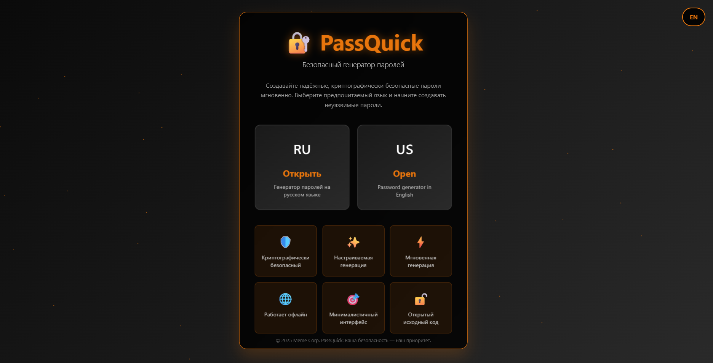
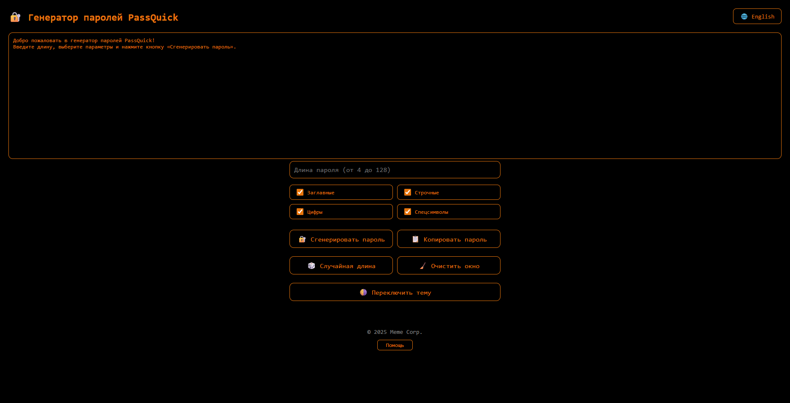
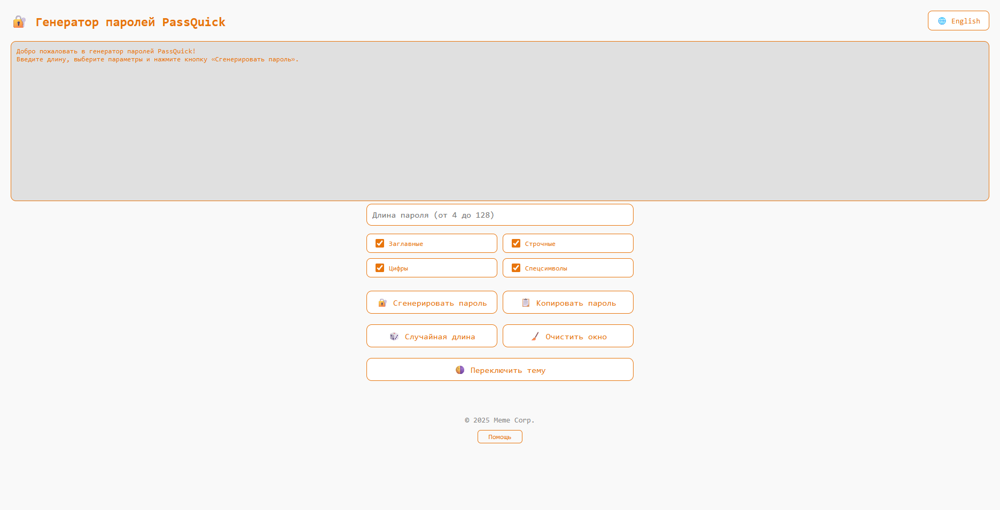
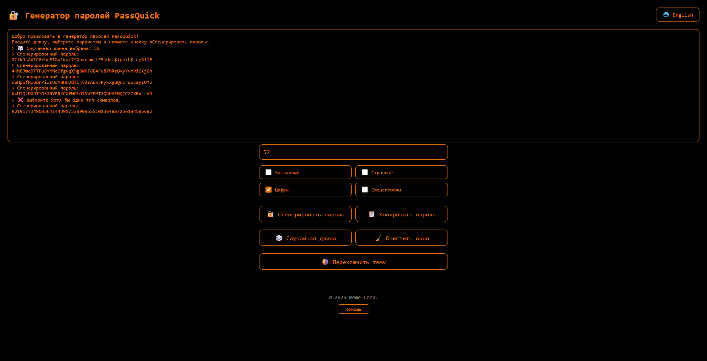
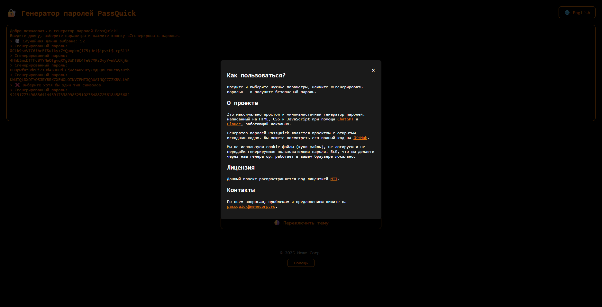

# 🔐 Генератор паролей PassQuick

---

### ℹ️ О проекте
**PassQuick** — это простой и быстрый генератор паролей, работающий прямо в браузере. Поддерживает русский и английский интерфейс, не требует установки и работает оффлайн. Все пароли генерируются локально, без отправки данных на сервер.

✅ **Особенности:**
- 🛡️ Криптографическая безопасность
- ⚡ Мгновенная генерация
- 🎯 Минималистичный интерфейс
- 🌍 Поддержка русского и английского
- 🖤 Тёмная тема
- ✨ Полная кастомизация (длина, символы)
- 🌐 Работает без интернета (PWA)
- 🔓 Открытый исходный код

---

### 🖼 Скриншоты

  
Нажмите, чтобы открыть

  
  
  
  
  
  

---

### 🌐 Онлайн-версия
👉 [https://passquick.memecorp.ru/](https://passquick.memecorp.ru/)

---

### ⚙️ Технический стек
- **HTML5**
- **CSS3**
- **JavaScript**
- **PWA (работает офлайн)**

---

### 🔎 Как использовать?
1. Откройте [сайт](https://passquick.memecorp.ru/)
2. Выберите язык интерфейса (RU/EN)
3. Укажите длину пароля и нужные параметры
4. Нажмите «Сгенерировать пароль»

---

### 📄 Лицензия
Проект распространяется под лицензией **MIT**.  
[Подробнее](LICENSE)

---

### 📬 Контакты
**Email:** passquick@memecorp.ru
