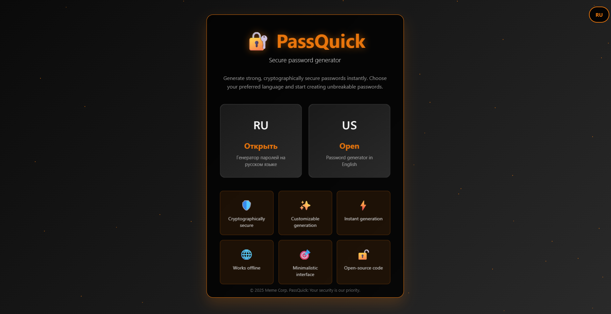
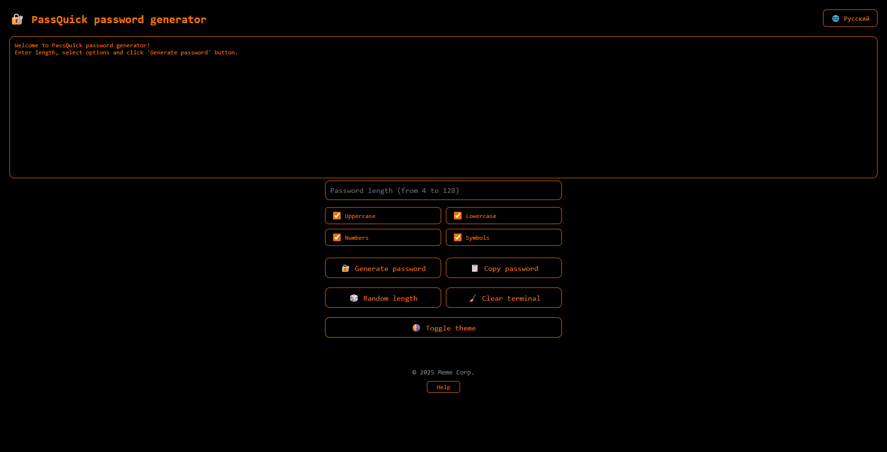
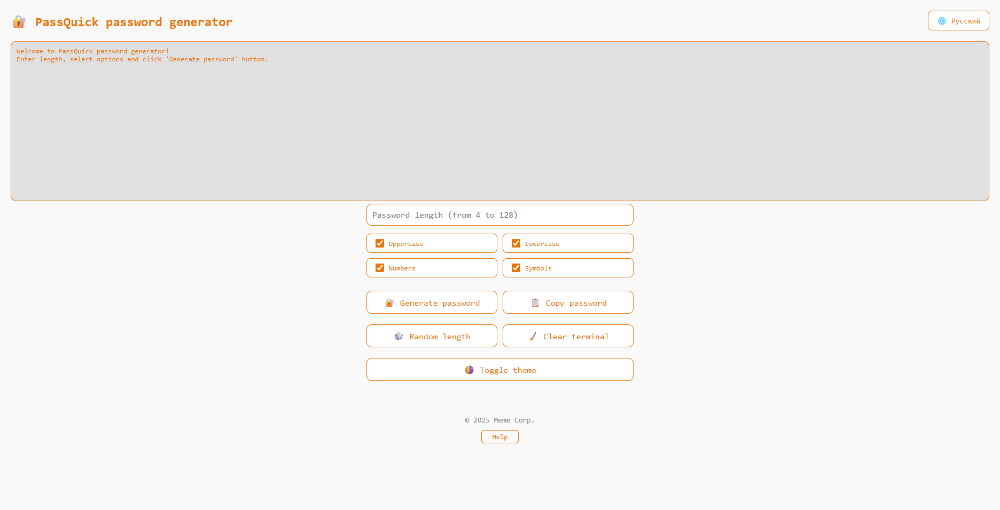
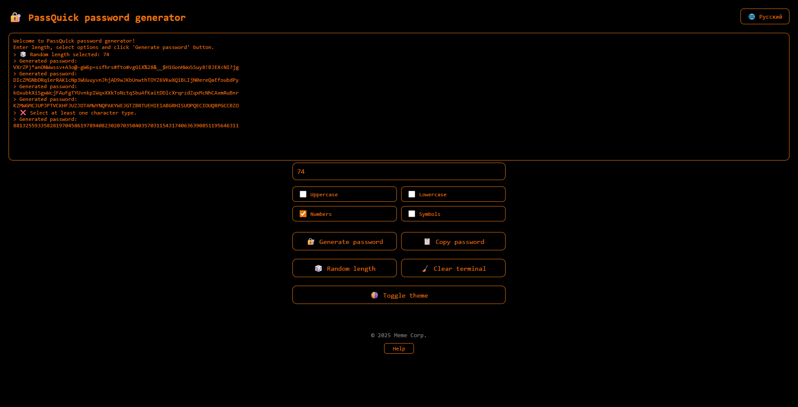
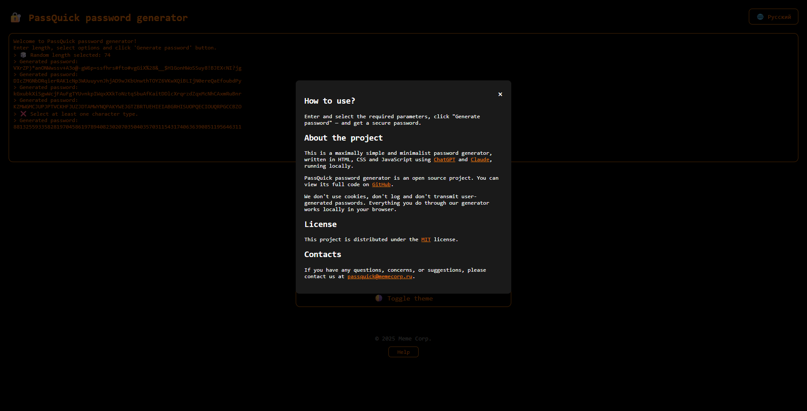

# 🔐 PassQuick password generator

[🇷🇺 Открыть русскую версию README](https://github.com/PassQuick/passquick-pw-gen-site/blob/main/README-ru.md)

---

### ℹ️ About project
**PassQuick** is a simple and fast password generator running directly in your browser. It supports both Russian and English interfaces, works offline, and requires no installation. All passwords are generated locally without sending any data to servers.

✅ **Features:**
- 🛡️ Cryptographically secure
- ⚡ Instant generation
- 🎯 Minimalistic design
- 🌍 RU & EN support
- 🖤 Dark mode
- ✨ Full customization (length, character types)
- 🌐 Works offline (PWA)
- 🔓 Open-source

---

### 🖼 Screenshots

  
Click to open

  
  
  
  
  
  

---

### 🌐 Online version
👉 [https://passquick.memecorp.ru/](https://passquick.memecorp.ru/)

---

### 🔎 How to use?
1. Open [site](https://passquick.memecorp.ru/)
2. Choose language (RU/EN)
3. Set password length and options
4. Click **"Generate password"**

---

### 📲 Installation as an application
PassQuick supports installation as a PWA (Progressive Web App) in Chrome, Edge, Yandex Browser, Safari and others on Windows, Linux, Android, macOS, iOS and iPadOS.

How to install:
1. Open the [PassQuick website](https://passquick.memecorp.ru/) in your browser.
2. Follow the instructions for installing web applications for your browser: [Google Chrome](https://support.google.com/chrome/answer/9658361), [Microsoft Edge](https://learn.microsoft.com/en-us/microsoft-edge/progressive-web-apps/ux), [Safari (macOS)](https://support.apple.com/en-us/104996), [Safari (iOS)](https://support.apple.com/en-ca/guide/iphone/iph42ab2f3a7/ios), [Safari (IPadOS)](https://support.apple.com/en-ca/guide/ipad/ipadc602b75b/ipados), [Yandex Browser](https://browser.yandex.ru/help/en/personalization/web-app.html).
4. Ready! PassQuick works as a standalone application and can be run offline without internet access.

---

### ⚙️ Tech stack
- **HTML5**
- **CSS3**
- **JavaScript**
- **PWA (offline support)**

---

### 📄 License
This project is licensed under the **MIT License**.  
[Learn more](https://github.com/PassQuick/passquick-pw-gen-site/blob/main/LICENSE)

---

### 📬 Contact
**Email:** passquick@memecorp.ru
